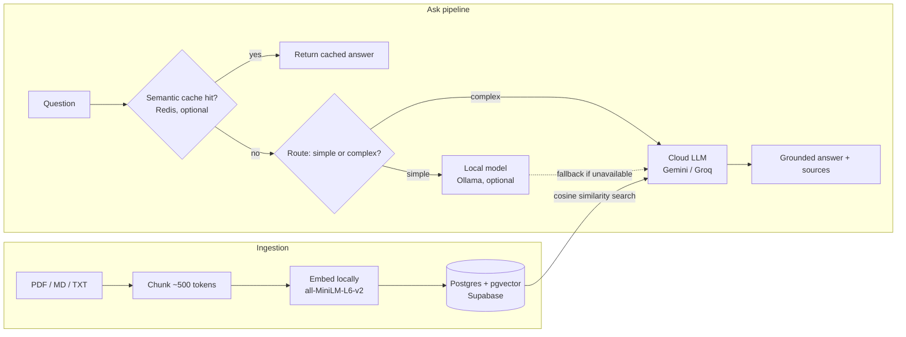

[](https://github.com/kr-bharath/AI-AGENTIC/actions/workflows/ci.yml)

# KnowledgeForge AI

A production-styled Retrieval-Augmented Generation system with an agentic reasoning layer and built-in cost/latency optimization — designed to answer questions over your own documents with cited sources, handle multi-step tasks a single RAG call can't, and keep cloud API spend down through caching and local-model routing.

**Live demo:** [ai-agentic-dyvg.onrender.com](https://ai-agentic-dyvg.onrender.com/docs)
*(Free-tier hosting — the first request after a period of inactivity takes 30–50s to wake the instance. Everything after that is fast.)*

---

## What it does

- **Retrieval-Augmented Generation** — ingest PDFs, Markdown, or text files; ask questions and get answers grounded in your own documents, with source citations, not the model's general knowledge.
- **Agentic reasoning** — a LangGraph-based agent handles multi-step tasks a single retrieval call can't, e.g. comparing multiple documents into a structured summary.
- **Cost-aware by design** — a semantic cache and a local-model router sit in front of the cloud LLM call, cutting redundant API spend without changing the answer quality contract.
- **CI/CD-gated quality** — every push runs linting, a pytest suite, and (on demand) an LLM-as-judge evaluation gate before anything ships.

## Architecture



Both the semantic cache and local-model routing are **optional by design** — if Redis or Ollama aren't reachable, the system falls back to calling the cloud LLM directly rather than failing the request. That's what let this same codebase run unchanged in a full local Docker Compose stack *and* as a single-container deployment with neither service present.

## Tech stack

| Layer | Choice | Why |
|---|---|---|
| API | FastAPI + Uvicorn | Async, auto-generated OpenAPI docs |
| Vector store | PostgreSQL + pgvector (Supabase) | SQL you already know, ACID guarantees, no separate vector DB to run |
| Embeddings | sentence-transformers (`all-MiniLM-L6-v2`) | Runs locally — embedding is free, only generation costs API calls |
| LLM | Gemini 2.0 Flash / Groq (Llama 3.3) | Generous free tiers, swappable via one config value |
| Agent framework | LangGraph | Explicit graph control over router → retrieve → synthesize → self-check |
| Caching | Redis (semantic similarity cache) | Optional — deflects repeat/near-duplicate queries from the LLM entirely |
| Local routing | Ollama | Optional — sends simple/factual queries to a free local model instead of a paid API |
| CI/CD | GitHub Actions | Lint → test → Docker build/push to GHCR → manual eval gate |
| Hosting | Render (free tier) | Single-container deploy straight from the repo's Dockerfile |

## Evaluation & cost optimization

*(Numbers below come from `eval_report.md` and `cost_optimization_report.md` — paste your actual figures in here once you have them; I've left this section structured but unfilled since I don't have those report files in front of me.)*

- Golden set: **[N] question/answer pairs** evaluated with RAGAS — faithfulness / answer relevancy / context precision scores: **[fill in]**
- Cache + local-routing benchmark: **[X]% of queries deflected from the cloud API**, **[Y]ms → [Z]ms** latency improvement, **~$[amount] saved per 1,000 queries**

## Engineering notes (the parts that actually broke)

A few real issues surfaced getting this from "works on my machine" to a public URL — worth more to an interviewer than a list of features that just worked:

- **pgvector + tiny datasets**: the `ivfflat` index (`lists = 100`) is approximate — with only a handful of rows, a query can legitimately miss the only relevant row because it lands in an unprobed cluster. Fixed by dropping the index for this corpus size; revisit with a tuned `lists`/`probes` value (or `hnsw`) if the document count grows into the thousands.
- **Supabase direct connections are IPv6-only** by default; most PaaS free tiers (Render included) are IPv4-only. Fixed by connecting through Supabase's Transaction pooler instead, which matches this app's per-request connection pattern.
- **Hugging Face Spaces changed its free-tier policy** — Docker and Gradio Spaces now require a paid plan; only Static Spaces stay free. Pivoted to Render's free web service tier mid-deployment rather than assuming the original plan still held.
- **CI branch mismatch**: `docker-build-push` is gated on `refs/heads/main`, but an early PR merge landed on `master` (the actual default branch) instead, silently skipping that job. Fixed by consolidating onto `main` as the single default branch.

## Running it locally

```bash
git clone https://github.com/kr-bharath/AI-AGENTIC.git
cd AI-AGENTIC
cp .env.example .env   # fill in your API keys
docker compose up
```

This brings up the FastAPI app, Postgres+pgvector, Redis, and Ollama together. Once running:

```bash
curl -X POST http://localhost:8000/ingest -F "file=@data/sample_docs/rag_basics.md"
curl -X POST http://localhost:8000/ask -H "Content-Type: application/json" \
  -d '{"question": "What is Retrieval-Augmented Generation?"}'
```

Interactive API docs: `http://localhost:8000/docs`

## Project structure

Built in phases, each mapped to a specific AI Engineer skill:

| Phase | Focus |
|---|---|
| 1 | Core RAG pipeline (Python, LLM APIs, prompt engineering, vector DB, SQL) |
| 2 | Agentic reasoning (LangGraph) |
| 3 | Evaluation & observability (RAGAS, Langfuse) |
| 4 | Cost/latency optimization (semantic cache, local routing) |
| 5 | FastAPI serving layer |
| 6 | Docker containerization |
| 7 | CI/CD (lint, test, eval gate, GHCR build) |

## What I'd add next

- Tune the vector index (`hnsw` or re-tuned `ivfflat`) once the corpus is large enough for it to matter.
- Persistent storage for a self-hosted Redis/Ollama layer, so the cost-optimization path runs in the live demo too (currently cloud-only there, by design, given free-tier hosting constraints).
- Kubernetes manifests and a Terraform-defined stack (planned as optional stretch modules, not yet built).

---

*Built as a self-directed AI Engineering portfolio project — [kr-bharath](https://github.com/kr-bharath).*
